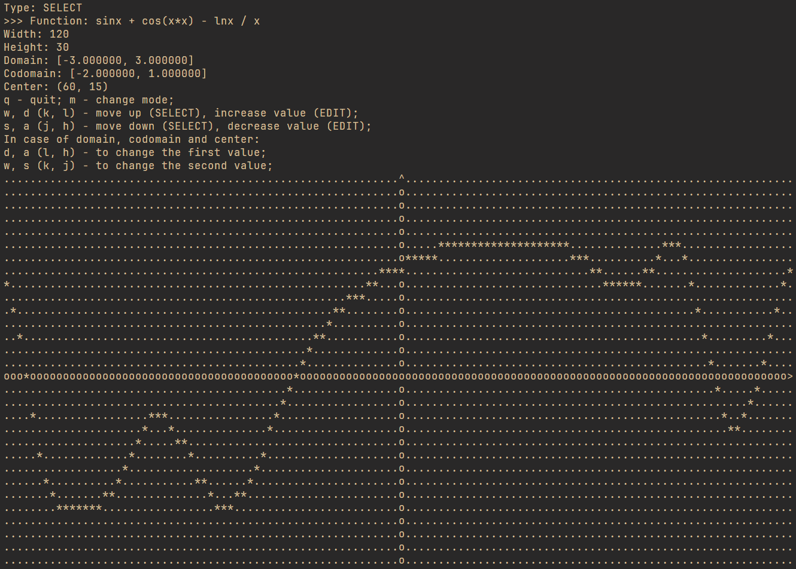
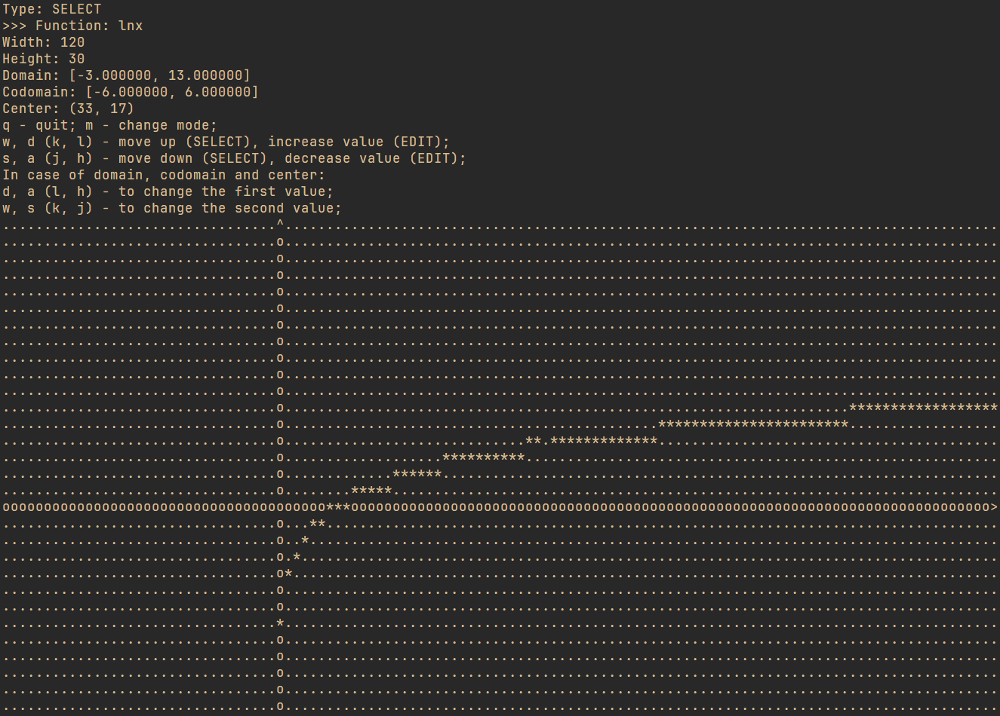

<h1 align="center">Math Function Drawer</h1>

<h3 align="center">A console application for drawing a graph of a function based on arbitrary expressions with editable parameters</h3>

<h2 id="table-of-contents">Table of Contents</h2>
<ul>
    <li><a href="#features">Features</a></li>
    <li><a href="#allowed-operations-and-functions">Allowed operations & functions</a></li>
    <li><a href="#technical-overview">Technical Overview</a></li>
    <li><a href="#conclusion">Conclusion</a></li>
</ul>

<h2 id="features">Features</h2>

- Draws graphs of user-defined mathematical expressions.
- Offers interactive menus for specifying graph parameters.
- Uses keyboard shortcuts for smooth navigation and editing.
- Includes trigonometric functions, square roots, and logarithms.

<h2 id="allowed-operations-and-functions">Allowed operations & functions</h2>

- Arithmetic: +, -, *, /.
- Parentheses: ().
- Trigonometric functions: sin(x), cos(x), tan(x), ctg(x).
- sqrt(x).
- ln(x).
- Floating point numbers.

<h2 id="technical-overview">Technical Overview</h2>

<h3>Tech stack</h3>

- Language: C++.
- Libraries: STL.
- Unit Testing: GoogleTest.
- Build System: CMake.
- Version Control: Git (GitFlow).

<h3>Solution</h3>

How is a graph based on a mathematical function:
1. The original function is cleared of spaces.
2. According to Dijkstra's algorithm, the given string is translated into Polish notation:

	2.1. The resulting string consisting of tokens is split into a queue of tokens if they are valid.

	2.2. Using the shunting yard algorithm, a queue of tokens written in infix order is converted into a queue of tokens in postfix order if no errors were found.

3. Then a specific value is selected from the domain, which replaces all tokens with an unknown (x) with this number from the received queue if there are no errors.
4. Then the resulting queue of tokens is emptied using the stack, receiving, in the successful case, the final value of the function with the specified argument.
5. Steps 3-4 are repeated until all values from the domain are processed.

<h3>Modular structure</h3>

To achieve this, the following modules have been created:
- Data_structures - contains manually created Queue\<T>, Stack\<T> and Node\<T>.
- Exceptions - contains exceptions for the cases of invalid field data or function.
- Parser - Responsible for breaking down the input function string into individual tokens.
- Polish_calculation - evaluates the final result of the expression.
- Renderer - handles the rendering of the resulting graph onto the terminal screen.
- Shunting_yard_alg - implements the Shunting-Yard Algorithm.
- Token - represents individual lexems extracted by the parser. Each token contains metadata about its type (number, operator, bracket, etc.) and may hold associated values.
- Utility - contains helper functions or general-purpose utilities shared across different parts of the program.
- User_err_mess_printer - responsible for displaying meaningful error messages.
- User_input - asks user and reads its input.

Each module has its own namespace in order avoid messing up the global space and to hide implementation details of each module.

<h3>Project Scalability & Maintainability</h3>

Why this project can be scaled:
- Modular structure: separate modules isolate functionality, allowing targeted scaling of bottlenecked components without affecting others. This simplifies maintenance, enhances extensibility, and promotes code reuse across projects.
- Core logic separation from the view: we can additioannly create GUI app.
- Each directory has its purpose: `src` contains implementations of the module interfaces from the `include/polish_notation` dir, `tests` contains unit-tests, `build` - artefacts and metadata needed to get the build.

<h2 id="conclusion">Conclusion</h2>
Through this project, I've improved my skills in creating maintainable and scalable software using a modular architecture.

I implemented generic data types such as Queue\<T> and Stack\<T>.

And practised more:
- Unit-testing and AAA pattern;
- Project building using CMake tool;
- git tool, GitFlow workflow and writing meaningful commit messages.
- Clean code principles and practices:
	- Single Responsibility Principle: each class/method has a single responsibility (e.g. Queue, Stack, module methods).
	- Separation of Concerns: logic (calculation) and presentation (rendering) are decoupled.
	- Descriptive Naming: clear variable and function names reflect purpose.
	- Encapsulation: internal states and implementation details hidden inside classes.
	- Code Reuse (DRY principle): common utilities factored out into reusable components.
	- Error Handling with the clear description instead of the method return values.

And, of course, I utilized various C++ language features, including OOP, templates, exceptions, and namespaces.
